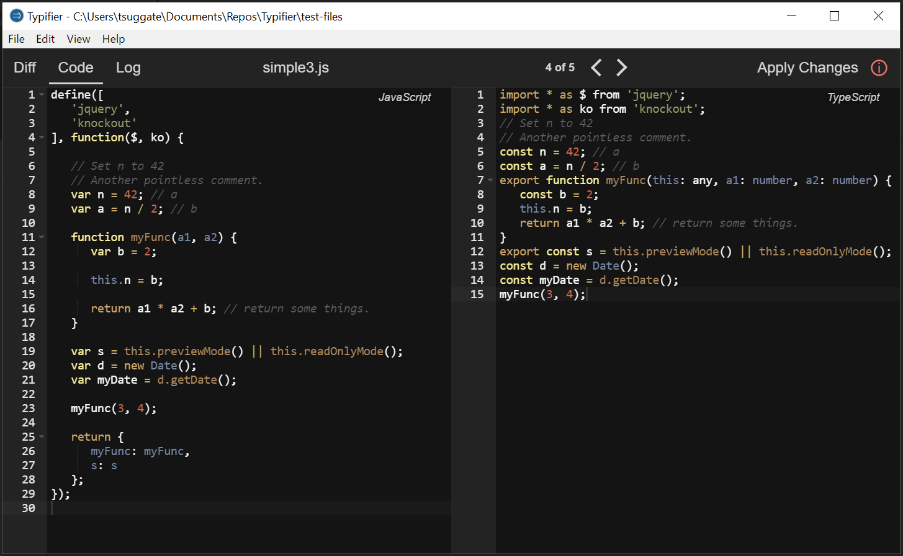

# Typifier

A desktop app for converting JavaScript files to Typescript. Most types are set to 'any'. The purpose of this app is make conversion of large JavaScript code bases easier.



### Build App/Installer

```
npm install
npm run make
npm run dist
```

### Develop:
Get dependencies:
`npm install`

Build and watch:
`npm run watch`

Debug:
`npm start`

Run tests:
`npm test`
